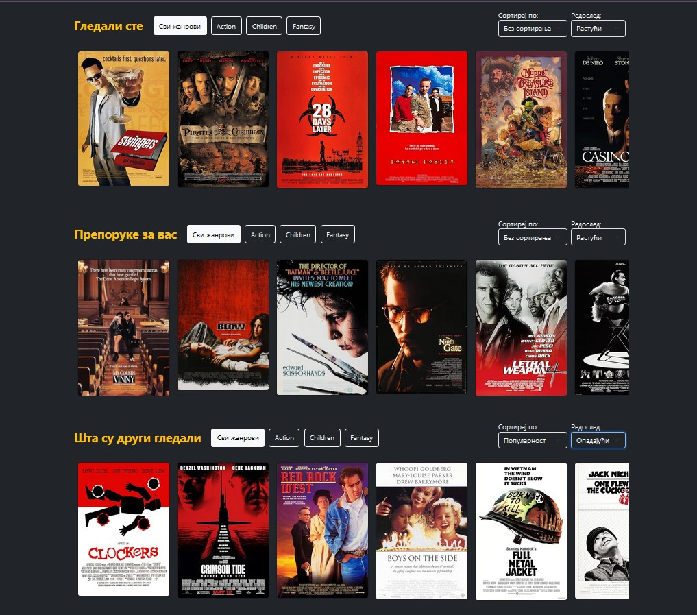
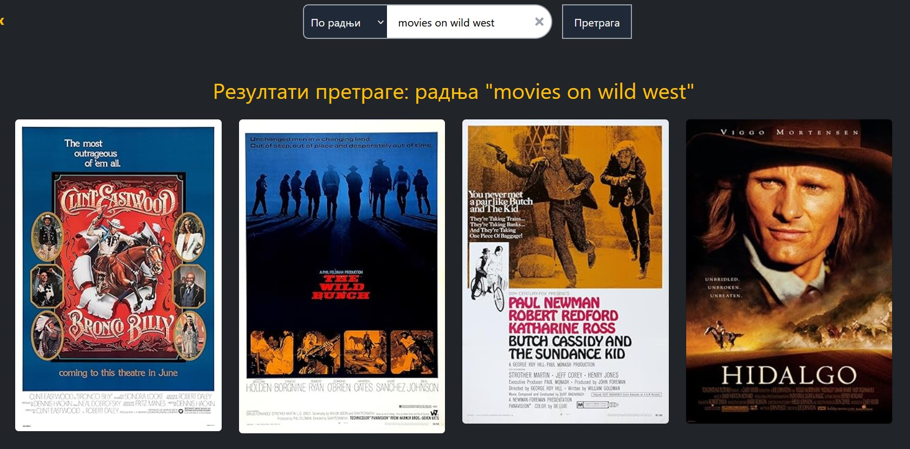
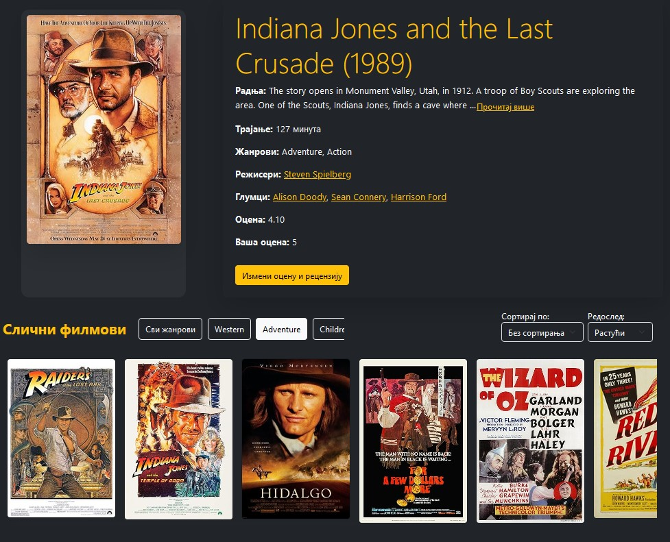

# 🎬 IMDb-Like Movie Recommendation System

This project is an **IMDb-like application** that provides **personalized movie recommendations** using **Neo4j** (graph database) and **Qdrant** (vector database). It is built with **React** (frontend) and **Django** (backend).

## 📌 Features
- **Movie Search & Discovery**: Find movies based on genres, actors, and popularity.
- **Personalized Recommendations**: AI-driven suggestions based on user interactions.
- **Neo4j for Relationships**: Tracks complex user-movie relationships.
- **Qdrant for Semantic Search**: Matches movies based on description and similarity.
- **User Authentication**: Secure login and personalized profiles.
- **Admin Panel**: Manage movie data and user access.
- **Modern UI**: Built with React for a seamless experience.

## 🚀 Technologies Used
| Component  | Technology |
|------------|------------|
| Frontend   | React, Redux, Tailwind CSS |
| Backend    | Django, Django REST Framework |
| Databases  | Neo4j (graph DB), Qdrant (vector DB) |
| Authentication | Django Authentication |
| Deployment | Docker (optional) |

## 📖 Usage
1. Register/Login as a user.
2. Search for movies by title, genre, or actors.
3. Get AI-based personalized movie recommendations.
4. Save favorite movies and rate them.
5. Admins can manage movie data.

## 🖼 Screenshots

### 🎥 Homepage

### 🔍 Movie Search

### 🤖 Personalized Recommendations

